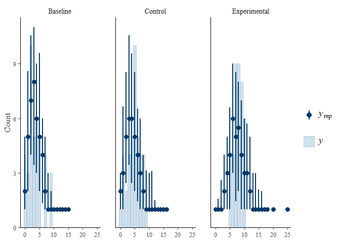

Data
================
A.Z.
2023-06-13

# Libraries

``` r
library(tidyverse)
library(ggpubr)
library(psych)
library(brms)
library(readxl)
library(stringr)
library(sjPlot)
```

# Reading the data

``` r
Data <- read_xlsx(path = "EXP_1.xlsx")%>%
  mutate(FIVE = as.numeric(FIVE))%>%
  pivot_longer(cols = c(2:10), 
               names_to = "Group", 
               values_to = "Choice")%>%
  rename(Day = "...1")%>%
  mutate(Treatment  =  
           if_else(Day %in% 
                     c("DAY 1", "DAY 2", "DAY 3", "DAY 4", "DAY 5"), "Baseline", 
                   if_else(Day %in% 
                             c("DAY 6", "DAY 7", "DAY 8", "DAY 9", "DAY 10"), 
                           if_else(Group %in% 
                                     c("ONE", "TWO", "THREE", "FOUR","FIVE"),
                                   "Experimental", "Control"),
                                          if_else(!(Group %in% 
                                                      c("ONE", "TWO", "THREE", "FOUR","FIVE")),
                                                  "Experimental", "Control"))))%>%
  mutate(Day = str_split(Day, " ") %>% map_chr(., 2))%>%
  mutate(Day = as.integer(Day))%>%
  filter(Group != "FIVE")%>%
  mutate(Order = if_else(Group %in% c("ONE", "TWO", "THREE", "FOUR"), "BEC" , "BCE"))
```

# Plotting

``` r
Data2 <- Data %>% 
        mutate(Week = if_else(Day %in% c(1:5), 'Week 1', if_else(Day %in% c(6:10), 'Week 2' , 'Week 3') ))%>%
  mutate(Day = ifelse(Day == 6 |Day == 11, 1, 
                      ifelse(Day == 7 |Day == 12, 2, 
                             ifelse(Day == 8 |Day == 13,3, 
                                    ifelse(Day == 9 |Day == 14, 4, 
                                                    ifelse(Day == 10 |Day == 15, 5, Day))))))
gd <- Data2%>%
        group_by(Order, Day, Week) %>% 
        summarise(Choice_sum = mean(Choice), sd = sd(Choice), Treatment = Treatment)


ggplot(data = gd, aes(x = Day, y = Choice_sum, color = Order))+
  geom_line(aes(linetype = Treatment), alpha = .8, size = 3)+
  geom_ribbon(aes(y = Choice_sum, ymin = Choice_sum - sd, ymax = Choice_sum + sd), alpha = .2)+
  scale_linetype_manual(values=c("dotted", "twodash", "solid"), labels = c("Baseline", "Food-Unrelated", "Food-Related")) +
  theme_bw()+
  facet_grid(~Week)+
  scale_y_continuous(breaks = seq(0, 10, by = 2),labels = function(x) paste0((x/10)*100, "%"))+
  scale_x_continuous(breaks = seq(1, 5, by = 1))+
  labs(title = "Choices across Days",
    y = "Percentage of Healthy Choices",
    color = NULL)  +
  guides(linetype=guide_legend(keywidth = 3, keyheight = 1),
    colour=guide_legend(keywidth = 3, keyheight = 1))
```

<!-- -->

``` r
ggsave('Exp1.jpeg', plot = last_plot())
```

# Bayesian Modeling

``` r
Data_uncontinous <- Data %>%
  mutate(Day = ifelse(Day == 6 |Day == 11, 1, 
                      ifelse(Day == 7 |Day == 12, 2, 
                             ifelse(Day == 8 |Day == 13,3, 
                                    ifelse(Day == 9 |Day == 14, 4, 
                                                    ifelse(Day == 10 |Day == 15, 5, Day))))))

Exp1_formula <- bf(formula = Choice ~ Day*Order*Treatment + 
                     (1|Group), 
                   family = negbinomial(link = "log", link_shape = "log"))
get_prior(Exp1_formula, data = Data_uncontinous)
```

    ##                   prior     class                               coef group resp
    ##                  (flat)         b                                              
    ##                  (flat)         b                                Day           
    ##                  (flat)         b                       Day:OrderBEC           
    ##                  (flat)         b      Day:OrderBEC:TreatmentControl           
    ##                  (flat)         b Day:OrderBEC:TreatmentExperimental           
    ##                  (flat)         b               Day:TreatmentControl           
    ##                  (flat)         b          Day:TreatmentExperimental           
    ##                  (flat)         b                           OrderBEC           
    ##                  (flat)         b          OrderBEC:TreatmentControl           
    ##                  (flat)         b     OrderBEC:TreatmentExperimental           
    ##                  (flat)         b                   TreatmentControl           
    ##                  (flat)         b              TreatmentExperimental           
    ##  student_t(3, 1.6, 2.5) Intercept                                              
    ##    student_t(3, 0, 2.5)        sd                                              
    ##    student_t(3, 0, 2.5)        sd                                    Group     
    ##    student_t(3, 0, 2.5)        sd                          Intercept Group     
    ##     inv_gamma(0.4, 0.3)     shape                                              
    ##  dpar nlpar lb ub       source
    ##                        default
    ##                   (vectorized)
    ##                   (vectorized)
    ##                   (vectorized)
    ##                   (vectorized)
    ##                   (vectorized)
    ##                   (vectorized)
    ##                   (vectorized)
    ##                   (vectorized)
    ##                   (vectorized)
    ##                   (vectorized)
    ##                   (vectorized)
    ##                        default
    ##              0         default
    ##              0    (vectorized)
    ##              0    (vectorized)
    ##              0         default

``` r
Exp1_priors <- set_prior("normal(0,2.5)", class = "b")

Exp_model <- brm(formula = Exp1_formula,
                 data = Data_uncontinous,
                 prior = Exp1_priors,
                 chains = 5,
                 iter = 6000,
                 warmup = 2000,
                 sample_prior = TRUE,
                 save_pars = save_pars(all = TRUE),
                 control = list(adapt_delta = 0.99),
                 core = 16,
                 file = 'models_Exp_1/model_complete') 
```

``` r
summary(Exp_model)
```

    ##  Family: negbinomial 
    ##   Links: mu = log; shape = identity 
    ## Formula: Choice ~ Day * Order * Treatment + (1 | Group) 
    ##    Data: Data_uncontinous (Number of observations: 120) 
    ##   Draws: 5 chains, each with iter = 6000; warmup = 2000; thin = 1;
    ##          total post-warmup draws = 20000
    ## 
    ## Multilevel Hyperparameters:
    ## ~Group (Number of levels: 8) 
    ##               Estimate Est.Error l-95% CI u-95% CI Rhat Bulk_ESS Tail_ESS
    ## sd(Intercept)     0.07      0.07     0.01     0.19 1.59        9      170
    ## 
    ## Regression Coefficients:
    ##                                    Estimate Est.Error l-95% CI u-95% CI Rhat
    ## Intercept                              1.16      0.27     0.65     1.57 1.56
    ## Day                                    0.05      0.08    -0.08     0.18 1.58
    ## OrderBEC                               0.58      0.36    -0.07     1.22 1.61
    ## TreatmentControl                       0.11      0.33    -0.43     0.84 1.72
    ## TreatmentExperimental                  1.10      0.29     0.58     1.65 1.49
    ## Day:OrderBEC                          -0.22      0.11    -0.43    -0.02 1.75
    ## Day:TreatmentControl                  -0.10      0.10    -0.31     0.08 1.58
    ## Day:TreatmentExperimental             -0.11      0.10    -0.26     0.06 1.31
    ## OrderBEC:TreatmentControl             -0.01      0.46    -0.83     0.82 1.54
    ## OrderBEC:TreatmentExperimental        -0.64      0.38    -1.38     0.10 1.50
    ## Day:OrderBEC:TreatmentControl          0.26      0.14    -0.01     0.51 1.76
    ## Day:OrderBEC:TreatmentExperimental     0.21      0.14    -0.02     0.45 1.54
    ##                                    Bulk_ESS Tail_ESS
    ## Intercept                                12      133
    ## Day                                      15      141
    ## OrderBEC                                 15      143
    ## TreatmentControl                         16      118
    ## TreatmentExperimental                    16      130
    ## Day:OrderBEC                             15        7
    ## Day:TreatmentControl                     20      127
    ## Day:TreatmentExperimental                12        8
    ## OrderBEC:TreatmentControl                14      122
    ## OrderBEC:TreatmentExperimental           18      132
    ## Day:OrderBEC:TreatmentControl            16      119
    ## Day:OrderBEC:TreatmentExperimental       13      122
    ## 
    ## Further Distributional Parameters:
    ##                 Estimate          Est.Error l-95% CI           u-95% CI Rhat
    ## shape 110506868227937.70 262517992826655.72    52.28 840999138350609.12 2.88
    ##       Bulk_ESS Tail_ESS
    ## shape        7       NA
    ## 
    ## Draws were sampled using sampling(NUTS). For each parameter, Bulk_ESS
    ## and Tail_ESS are effective sample size measures, and Rhat is the potential
    ## scale reduction factor on split chains (at convergence, Rhat = 1).

``` r
numdraw <- 50
pp_check(Exp_model, 
         type = "bars_grouped",
         group = "Treatment",
         ndraws = numdraw)
```

<!-- -->

``` r
mcmc_plot(Exp_model,
          variable = variables(Exp_model)[c(1:12)],
          HPD = TRUE)+
  labs(title = expression(paste("Posterior Distributions of ",italic(beta), "s")))+
  # scale_y_discrete(labels=rev(c(
  # "Mod_sin",
  # "Mod_evec",
  # "Pos",
  # "Pos:Mod_sin",
  # "Pos:Mod_evec")), limits = rev,
  # guide = guide_axis(n.dodge = 2))+
  geom_vline(xintercept = c(0), linetype = "dashed") +
  theme_bw(10)+
  theme(axis.text.y = element_text(angle = 0, hjust = .5))
```

<!-- -->

# Checking multicolinearity in the ACC model

``` r
mcmc_plot(
  Exp_model,
  variable = variables(Exp_model)[2:5],
  type = 'pairs',
  diag_fun = 'dens',
  off_diag_fun = 'hex',
  fixed = TRUE)
```

<!-- --> \#
Hypotheses

``` r
Data_uncontinous%>%
  group_by(Treatment)%>%
  summarise(mean = mean(Choice), sd = sd(Choice))
```

    ## # A tibble: 3 × 3
    ##   Treatment     mean    sd
    ##   <chr>        <dbl> <dbl>
    ## 1 Baseline      3.55  2.50
    ## 2 Control       4.72  2.25
    ## 3 Experimental  7.78  1.53

``` r
hypothesis(Exp_model, "TreatmentExperimental > 0")
```

    ## Hypothesis Tests for class b:
    ##                 Hypothesis Estimate Est.Error CI.Lower CI.Upper Evid.Ratio
    ## 1 (TreatmentExperim... > 0      1.1      0.29     0.69     1.55      19999
    ##   Post.Prob Star
    ## 1         1    *
    ## ---
    ## 'CI': 90%-CI for one-sided and 95%-CI for two-sided hypotheses.
    ## '*': For one-sided hypotheses, the posterior probability exceeds 95%;
    ## for two-sided hypotheses, the value tested against lies outside the 95%-CI.
    ## Posterior probabilities of point hypotheses assume equal prior probabilities.

``` r
hypothesis(Exp_model, "TreatmentExperimental- TreatmentControl> 0")
```

    ## Hypothesis Tests for class b:
    ##                 Hypothesis Estimate Est.Error CI.Lower CI.Upper Evid.Ratio
    ## 1 (TreatmentExperim... > 0        1      0.26     0.49     1.32        624
    ##   Post.Prob Star
    ## 1         1    *
    ## ---
    ## 'CI': 90%-CI for one-sided and 95%-CI for two-sided hypotheses.
    ## '*': For one-sided hypotheses, the posterior probability exceeds 95%;
    ## for two-sided hypotheses, the value tested against lies outside the 95%-CI.
    ## Posterior probabilities of point hypotheses assume equal prior probabilities.

``` r
hypothesis(Exp_model, "TreatmentControl > 0")
```

    ## Hypothesis Tests for class b:
    ##               Hypothesis Estimate Est.Error CI.Lower CI.Upper Evid.Ratio
    ## 1 (TreatmentControl) > 0     0.11      0.33    -0.28     0.69       0.85
    ##   Post.Prob Star
    ## 1      0.46     
    ## ---
    ## 'CI': 90%-CI for one-sided and 95%-CI for two-sided hypotheses.
    ## '*': For one-sided hypotheses, the posterior probability exceeds 95%;
    ## for two-sided hypotheses, the value tested against lies outside the 95%-CI.
    ## Posterior probabilities of point hypotheses assume equal prior probabilities.

``` r
Data_uncontinous%>%
  group_by(Order)%>%
  summarise(mean = mean(Choice), sd = sd(Choice))
```

    ## # A tibble: 2 × 3
    ##   Order  mean    sd
    ##   <chr> <dbl> <dbl>
    ## 1 BCE    4.95  2.88
    ## 2 BEC    5.75  2.61

``` r
hypothesis(Exp_model, "OrderBEC > 0")
```

    ## Hypothesis Tests for class b:
    ##       Hypothesis Estimate Est.Error CI.Lower CI.Upper Evid.Ratio Post.Prob Star
    ## 1 (OrderBEC) > 0     0.58      0.36     0.08     1.16      27.09      0.96    *
    ## ---
    ## 'CI': 90%-CI for one-sided and 95%-CI for two-sided hypotheses.
    ## '*': For one-sided hypotheses, the posterior probability exceeds 95%;
    ## for two-sided hypotheses, the value tested against lies outside the 95%-CI.
    ## Posterior probabilities of point hypotheses assume equal prior probabilities.

``` r
hypothesis(Exp_model, "OrderBEC:TreatmentExperimental < 0")
```

    ## Hypothesis Tests for class b:
    ##                 Hypothesis Estimate Est.Error CI.Lower CI.Upper Evid.Ratio
    ## 1 (OrderBEC:Treatme... < 0    -0.64      0.38    -1.21    -0.06      23.88
    ##   Post.Prob Star
    ## 1      0.96    *
    ## ---
    ## 'CI': 90%-CI for one-sided and 95%-CI for two-sided hypotheses.
    ## '*': For one-sided hypotheses, the posterior probability exceeds 95%;
    ## for two-sided hypotheses, the value tested against lies outside the 95%-CI.
    ## Posterior probabilities of point hypotheses assume equal prior probabilities.

``` r
hypothesis(Exp_model, "OrderBEC:TreatmentControl = 0")
```

    ## Hypothesis Tests for class b:
    ##                 Hypothesis Estimate Est.Error CI.Lower CI.Upper Evid.Ratio
    ## 1 (OrderBEC:Treatme... = 0    -0.01      0.46    -0.83     0.82       6.11
    ##   Post.Prob Star
    ## 1      0.86     
    ## ---
    ## 'CI': 90%-CI for one-sided and 95%-CI for two-sided hypotheses.
    ## '*': For one-sided hypotheses, the posterior probability exceeds 95%;
    ## for two-sided hypotheses, the value tested against lies outside the 95%-CI.
    ## Posterior probabilities of point hypotheses assume equal prior probabilities.

# Creating necessary models for Type-II comparison

``` r
model.fit.rdto <- update(Exp_model, 
                       formula = ~ . -Day:Order:Treatment, 
                       core = 16,
                       file = 'models_Exp_1/model_rdto')

model.fit.rto <- update(Exp_model, 
                       formula = ~ . -Order:Treatment 
                       -Day:Order:Treatment, 
                       core = 16,
                       file = 'models_Exp_1/model_rto')

model.fit.rdt <- update(Exp_model, 
                       formula = ~ . -Day:Treatment 
                       -Day:Order:Treatment,
                       core = 16,
                       file = 'models_Exp_1/model_rdt')

model.fit.rdo <- update(Exp_model, 
                       formula = ~ . -Day:Order 
                       -Day:Order:Treatment, 
                       core = 16,
                       file = 'models_Exp_1/model_rdo')

model.fit.lvl1 <- update(Exp_model, 
                       formula = ~ . -Order:Treatment
                       -Day:Order 
                       -Day:Treatment 
                       -Day:Order:Treatment,
                       core = 16,
                       file = 'models_Exp_1/model_lvl1')

model.fit.rd <- update(Exp_model, 
                       formula = ~ . -Day
                       -Day:Order -Day:Treatment -Order:Treatment
                       -Day:Order:Treatment,
                       core = 16,
                       file = 'models_Exp_1/model_rd')

model.fit.rt <- update(Exp_model, 
                       formula = ~ . -Treatment 
                       -Day:Order -Day:Treatment -Order:Treatment 
                       -Day:Order:Treatment, 
                       core = 16,
                       file = 'models_Exp_1/model_rt')

model.fit.ro <- update(Exp_model, 
                       formula = ~ . -Order 
                       -Day:Order -Day:Treatment -Order:Treatment
                       -Day:Order:Treatment, 
                       core = 16,
                       file = 'models_Exp_1/model_ro')
```

# Calculating Bayes factors

``` r
BF_rdto = bayes_factor(Exp_model, model.fit.rdto)
BF_rto = bayes_factor(model.fit.rdto, model.fit.rto)
BF_rdt = bayes_factor(model.fit.rdto, model.fit.rdt)
BF_rdo = bayes_factor(model.fit.rdto, model.fit.rdo)
BF_rd = bayes_factor(model.fit.lvl1, model.fit.rd)
BF_rt = bayes_factor(model.fit.lvl1, model.fit.rt)
BF_ro = bayes_factor(model.fit.lvl1, model.fit.ro)
```

# Presenting Bayes factors and model comparisons

``` r
BF_rdto
```

    ## Estimated Bayes factor in favor of Exp_model over model.fit.rdto: 0.00000

``` r
BF_rto
```

    ## Estimated Bayes factor in favor of model.fit.rdto over model.fit.rto:    Inf

``` r
BF_rdt
```

    ## Estimated Bayes factor in favor of model.fit.rdto over model.fit.rdt:    Inf

``` r
BF_rdo
```

    ## Estimated Bayes factor in favor of model.fit.rdto over model.fit.rdo:    Inf

``` r
BF_rd
```

    ## Estimated Bayes factor in favor of model.fit.lvl1 over model.fit.rd:    Inf

``` r
BF_rt
```

    ## Estimated Bayes factor in favor of model.fit.lvl1 over model.fit.rt:    Inf

``` r
BF_ro
```

    ## Estimated Bayes factor in favor of model.fit.lvl1 over model.fit.ro: 1518814982874737034980446264426080664648404402226828200886668288462262428644224208060846666006626048424868860686266048642684688048086824804402460860248884064440460664022600844680224286282628008428462628682882046024488640884240040648046400664200608820828042042840868246664468888666428442026688846400668046.00000

``` r
loo(Exp_model,
    model.fit.rdto)
```

    ## Output of model 'Exp_model':
    ## 
    ## Computed from 20000 by 120 log-likelihood matrix.
    ## 
    ##          Estimate   SE
    ## elpd_loo   -267.0  8.5
    ## p_loo        12.0  2.2
    ## looic       534.0 17.0
    ## ------
    ## MCSE of elpd_loo is NA.
    ## MCSE and ESS estimates assume MCMC draws (r_eff in [0.0, 0.0]).
    ## 
    ## Pareto k diagnostic values:
    ##                          Count Pct.    Min. ESS
    ## (-Inf, 0.7]   (good)     49    40.8%   1       
    ##    (0.7, 1]   (bad)       4     3.3%   <NA>    
    ##    (1, Inf)   (very bad) 67    55.8%   <NA>    
    ## See help('pareto-k-diagnostic') for details.
    ## 
    ## Output of model 'model.fit.rdto':
    ## 
    ## Computed from 20000 by 120 log-likelihood matrix.
    ## 
    ##          Estimate   SE
    ## elpd_loo   -267.2  7.7
    ## p_loo         9.5  1.7
    ## looic       534.5 15.4
    ## ------
    ## MCSE of elpd_loo is NA.
    ## MCSE and ESS estimates assume MCMC draws (r_eff in [0.0, 0.0]).
    ## 
    ## Pareto k diagnostic values:
    ##                          Count Pct.    Min. ESS
    ## (-Inf, 0.7]   (good)     56    46.7%   1       
    ##    (0.7, 1]   (bad)       3     2.5%   <NA>    
    ##    (1, Inf)   (very bad) 61    50.8%   <NA>    
    ## See help('pareto-k-diagnostic') for details.
    ## 
    ## Model comparisons:
    ##                elpd_diff se_diff
    ## Exp_model       0.0       0.0   
    ## model.fit.rdto -0.2       3.4

``` r
loo(model.fit.rdto,
    model.fit.rto)
```

    ## Output of model 'model.fit.rdto':
    ## 
    ## Computed from 20000 by 120 log-likelihood matrix.
    ## 
    ##          Estimate   SE
    ## elpd_loo   -267.2  7.7
    ## p_loo         9.5  1.7
    ## looic       534.5 15.4
    ## ------
    ## MCSE of elpd_loo is NA.
    ## MCSE and ESS estimates assume MCMC draws (r_eff in [0.0, 0.0]).
    ## 
    ## Pareto k diagnostic values:
    ##                          Count Pct.    Min. ESS
    ## (-Inf, 0.7]   (good)     56    46.7%   1       
    ##    (0.7, 1]   (bad)       3     2.5%   <NA>    
    ##    (1, Inf)   (very bad) 61    50.8%   <NA>    
    ## See help('pareto-k-diagnostic') for details.
    ## 
    ## Output of model 'model.fit.rto':
    ## 
    ## Computed from 20000 by 120 log-likelihood matrix.
    ## 
    ##          Estimate   SE
    ## elpd_loo   -273.2  8.2
    ## p_loo         8.6  1.4
    ## looic       546.4 16.3
    ## ------
    ## MCSE of elpd_loo is NA.
    ## MCSE and ESS estimates assume MCMC draws (r_eff in [0.0, 1.2]).
    ## 
    ## Pareto k diagnostic values:
    ##                          Count Pct.    Min. ESS
    ## (-Inf, 0.7]   (good)     118   98.3%   17      
    ##    (0.7, 1]   (bad)        1    0.8%   <NA>    
    ##    (1, Inf)   (very bad)   1    0.8%   <NA>    
    ## See help('pareto-k-diagnostic') for details.
    ## 
    ## Model comparisons:
    ##                elpd_diff se_diff
    ## model.fit.rdto  0.0       0.0   
    ## model.fit.rto  -6.0       3.5

``` r
loo(model.fit.rdto,
    model.fit.rdt)
```

    ## Output of model 'model.fit.rdto':
    ## 
    ## Computed from 20000 by 120 log-likelihood matrix.
    ## 
    ##          Estimate   SE
    ## elpd_loo   -267.2  7.7
    ## p_loo         9.5  1.7
    ## looic       534.5 15.4
    ## ------
    ## MCSE of elpd_loo is NA.
    ## MCSE and ESS estimates assume MCMC draws (r_eff in [0.0, 0.0]).
    ## 
    ## Pareto k diagnostic values:
    ##                          Count Pct.    Min. ESS
    ## (-Inf, 0.7]   (good)     56    46.7%   1       
    ##    (0.7, 1]   (bad)       3     2.5%   <NA>    
    ##    (1, Inf)   (very bad) 61    50.8%   <NA>    
    ## See help('pareto-k-diagnostic') for details.
    ## 
    ## Output of model 'model.fit.rdt':
    ## 
    ## Computed from 20000 by 120 log-likelihood matrix.
    ## 
    ##          Estimate   SE
    ## elpd_loo   -263.8  7.6
    ## p_loo         7.2  1.1
    ## looic       527.6 15.1
    ## ------
    ## MCSE of elpd_loo is NA.
    ## MCSE and ESS estimates assume MCMC draws (r_eff in [0.0, 0.2]).
    ## 
    ## Pareto k diagnostic values:
    ##                          Count Pct.    Min. ESS
    ## (-Inf, 0.7]   (good)     97    80.8%   3       
    ##    (0.7, 1]   (bad)       0     0.0%   <NA>    
    ##    (1, Inf)   (very bad) 23    19.2%   <NA>    
    ## See help('pareto-k-diagnostic') for details.
    ## 
    ## Model comparisons:
    ##                elpd_diff se_diff
    ## model.fit.rdt   0.0       0.0   
    ## model.fit.rdto -3.4       1.0

``` r
loo(model.fit.rdto,
    model.fit.rdo)
```

    ## Output of model 'model.fit.rdto':
    ## 
    ## Computed from 20000 by 120 log-likelihood matrix.
    ## 
    ##          Estimate   SE
    ## elpd_loo   -267.2  7.7
    ## p_loo         9.5  1.7
    ## looic       534.5 15.4
    ## ------
    ## MCSE of elpd_loo is NA.
    ## MCSE and ESS estimates assume MCMC draws (r_eff in [0.0, 0.0]).
    ## 
    ## Pareto k diagnostic values:
    ##                          Count Pct.    Min. ESS
    ## (-Inf, 0.7]   (good)     56    46.7%   1       
    ##    (0.7, 1]   (bad)       3     2.5%   <NA>    
    ##    (1, Inf)   (very bad) 61    50.8%   <NA>    
    ## See help('pareto-k-diagnostic') for details.
    ## 
    ## Output of model 'model.fit.rdo':
    ## 
    ## Computed from 20000 by 120 log-likelihood matrix.
    ## 
    ##          Estimate   SE
    ## elpd_loo   -266.8  8.8
    ## p_loo        10.3  2.3
    ## looic       533.5 17.5
    ## ------
    ## MCSE of elpd_loo is NA.
    ## MCSE and ESS estimates assume MCMC draws (r_eff in [0.0, 1.0]).
    ## 
    ## Pareto k diagnostic values:
    ##                          Count Pct.    Min. ESS
    ## (-Inf, 0.7]   (good)     94    78.3%   5       
    ##    (0.7, 1]   (bad)       2     1.7%   <NA>    
    ##    (1, Inf)   (very bad) 24    20.0%   <NA>    
    ## See help('pareto-k-diagnostic') for details.
    ## 
    ## Model comparisons:
    ##                elpd_diff se_diff
    ## model.fit.rdo   0.0       0.0   
    ## model.fit.rdto -0.5       2.0

``` r
loo(model.fit.lvl1,
    model.fit.rt,
    model.fit.ro)
```

    ## Output of model 'model.fit.lvl1':
    ## 
    ## Computed from 20000 by 120 log-likelihood matrix.
    ## 
    ##          Estimate   SE
    ## elpd_loo   -272.3  8.3
    ## p_loo         7.3  1.1
    ## looic       544.7 16.6
    ## ------
    ## MCSE of elpd_loo is NA.
    ## MCSE and ESS estimates assume MCMC draws (r_eff in [0.0, 0.0]).
    ## 
    ## Pareto k diagnostic values:
    ##                          Count Pct.    Min. ESS
    ## (-Inf, 0.7]   (good)     70    58.3%   2       
    ##    (0.7, 1]   (bad)       2     1.7%   <NA>    
    ##    (1, Inf)   (very bad) 48    40.0%   <NA>    
    ## See help('pareto-k-diagnostic') for details.
    ## 
    ## Output of model 'model.fit.rt':
    ## 
    ## Computed from 20000 by 120 log-likelihood matrix.
    ## 
    ##          Estimate   SE
    ## elpd_loo   -299.6  6.6
    ## p_loo         5.3  0.6
    ## looic       599.2 13.2
    ## ------
    ## MCSE of elpd_loo is 0.0.
    ## MCSE and ESS estimates assume MCMC draws (r_eff in [0.5, 1.4]).
    ## 
    ## All Pareto k estimates are good (k < 0.7).
    ## See help('pareto-k-diagnostic') for details.
    ## 
    ## Output of model 'model.fit.ro':
    ## 
    ## Computed from 20000 by 120 log-likelihood matrix.
    ## 
    ##          Estimate   SE
    ## elpd_loo   -274.4  8.4
    ## p_loo         8.5  1.3
    ## looic       548.9 16.8
    ## ------
    ## MCSE of elpd_loo is NA.
    ## MCSE and ESS estimates assume MCMC draws (r_eff in [0.0, 0.1]).
    ## 
    ## Pareto k diagnostic values:
    ##                          Count Pct.    Min. ESS
    ## (-Inf, 0.7]   (good)     77    64.2%   2       
    ##    (0.7, 1]   (bad)       4     3.3%   <NA>    
    ##    (1, Inf)   (very bad) 39    32.5%   <NA>    
    ## See help('pareto-k-diagnostic') for details.
    ## 
    ## Model comparisons:
    ##                elpd_diff se_diff
    ## model.fit.lvl1   0.0       0.0  
    ## model.fit.ro    -2.1       1.8  
    ## model.fit.rt   -27.3       6.7

``` r
loo(model.fit.lvl1,
    model.fit.rd)
```

    ## Output of model 'model.fit.lvl1':
    ## 
    ## Computed from 20000 by 120 log-likelihood matrix.
    ## 
    ##          Estimate   SE
    ## elpd_loo   -272.3  8.3
    ## p_loo         7.3  1.1
    ## looic       544.7 16.6
    ## ------
    ## MCSE of elpd_loo is NA.
    ## MCSE and ESS estimates assume MCMC draws (r_eff in [0.0, 0.0]).
    ## 
    ## Pareto k diagnostic values:
    ##                          Count Pct.    Min. ESS
    ## (-Inf, 0.7]   (good)     70    58.3%   2       
    ##    (0.7, 1]   (bad)       2     1.7%   <NA>    
    ##    (1, Inf)   (very bad) 48    40.0%   <NA>    
    ## See help('pareto-k-diagnostic') for details.
    ## 
    ## Output of model 'model.fit.rd':
    ## 
    ## Computed from 20000 by 120 log-likelihood matrix.
    ## 
    ##          Estimate   SE
    ## elpd_loo   -271.1  7.7
    ## p_loo         5.8  0.7
    ## looic       542.3 15.4
    ## ------
    ## MCSE of elpd_loo is 0.7.
    ## MCSE and ESS estimates assume MCMC draws (r_eff in [0.0, 0.4]).
    ## 
    ## All Pareto k estimates are good (k < 0.7).
    ## See help('pareto-k-diagnostic') for details.
    ## 
    ## Model comparisons:
    ##                elpd_diff se_diff
    ## model.fit.rd    0.0       0.0   
    ## model.fit.lvl1 -1.2       1.7
