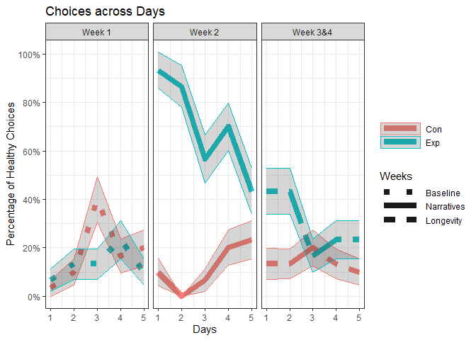
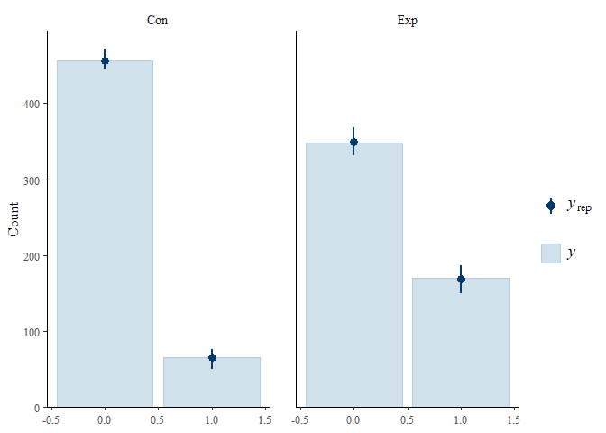
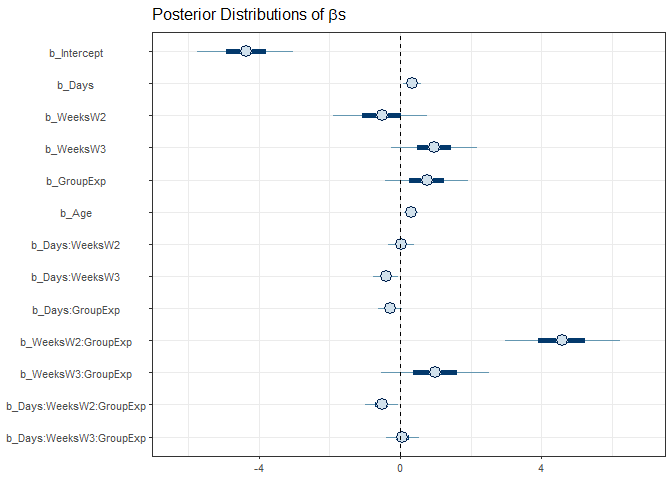
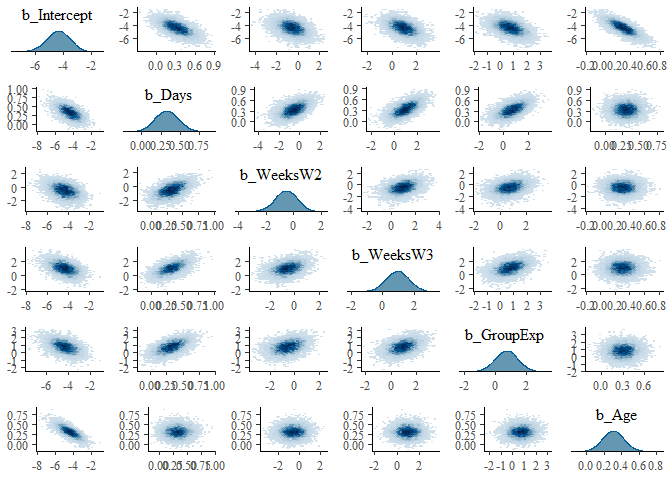

Behavior_Second_Study
================
A.Z.
2024-06-03

# Libraries

``` r
library(tidyverse)
```

    ## Warning: package 'ggplot2' was built under R version 4.3.3

    ## Warning: package 'tidyr' was built under R version 4.3.3

    ## Warning: package 'readr' was built under R version 4.3.3

    ## Warning: package 'purrr' was built under R version 4.3.3

    ## Warning: package 'dplyr' was built under R version 4.3.3

    ## Warning: package 'stringr' was built under R version 4.3.3

    ## Warning: package 'lubridate' was built under R version 4.3.3

    ## ── Attaching core tidyverse packages ──────────────────────── tidyverse 2.0.0 ──
    ## ✔ dplyr     1.1.4     ✔ readr     2.1.5
    ## ✔ forcats   1.0.0     ✔ stringr   1.5.1
    ## ✔ ggplot2   3.5.1     ✔ tibble    3.2.1
    ## ✔ lubridate 1.9.4     ✔ tidyr     1.3.1
    ## ✔ purrr     1.0.4     
    ## ── Conflicts ────────────────────────────────────────── tidyverse_conflicts() ──
    ## ✖ dplyr::filter() masks stats::filter()
    ## ✖ dplyr::lag()    masks stats::lag()
    ## ℹ Use the conflicted package (<http://conflicted.r-lib.org/>) to force all conflicts to become errors

``` r
library(ggpubr)
library(psych)
```

    ## Warning: package 'psych' was built under R version 4.3.3

    ## 
    ## Attaching package: 'psych'
    ## 
    ## The following objects are masked from 'package:ggplot2':
    ## 
    ##     %+%, alpha

``` r
library(brms)
```

    ## Warning: package 'brms' was built under R version 4.3.3

    ## Loading required package: Rcpp

    ## Warning: package 'Rcpp' was built under R version 4.3.3

    ## Loading 'brms' package (version 2.22.0). Useful instructions
    ## can be found by typing help('brms'). A more detailed introduction
    ## to the package is available through vignette('brms_overview').
    ## 
    ## Attaching package: 'brms'
    ## 
    ## The following object is masked from 'package:psych':
    ## 
    ##     cs
    ## 
    ## The following object is masked from 'package:stats':
    ## 
    ##     ar

``` r
library(readxl)
```

    ## Warning: package 'readxl' was built under R version 4.3.3

``` r
library(stringr)
library(sjPlot)
```

    ## Warning: package 'sjPlot' was built under R version 4.3.3

# Reading the second dataset

``` r
data_con <- read_xlsx(path = "EXP_2.xlsx", sheet = "Control Group", na = 'NA')%>%
  pivot_longer(cols = c(3:17),
               names_to = c("Weeks ", "Days"), 
               names_sep = "_",
               values_to = "Choice")%>%
  mutate(Group = "Con")

data_exp <- read_xlsx(path = "EXP_2.xlsx", sheet = "Experimental Group", na = 'NA')%>%
    pivot_longer(cols = c(3:17),
               names_to = c("Weeks ", "Days"), 
               names_sep = "_",
               values_to = "Choice")%>%
  mutate(Group = "Exp")

data_full <- rbind(data_con, data_exp) %>%
  mutate(Choice = if_else(Choice == "S", 0, 1))%>%
  mutate(Weeks = as.factor(`Weeks `))%>%
  relocate(Weeks, .before = `Weeks `)%>%
  select(!`Weeks `)%>%
  mutate(ID = as.factor(ID))%>%
  mutate(Group = as.factor(Group))%>%
  filter(!is.na(Choice))%>%
  mutate(Days = as.numeric(Days))
```

# Plotting

``` r
gd <- data_full %>%
        mutate(Days = as.numeric(Days))%>%
        mutate(Weeks = fct_recode(Weeks, 'Week 1' = 'W1'))%>%
        mutate(Weeks = fct_recode(Weeks, 'Week 2' = 'W2'))%>%
        mutate(Weeks = fct_recode(Weeks, 'Week 3&4' = 'W3'))%>%
        # mutate(Days = ifelse(Weeks == "W2", Days + 5, ifelse(Weeks == "W3", Days + 10, Days )))%>%
        # mutate(Days = as.factor(Days))%>%
        group_by(Group, Days, Weeks) %>%
        summarise(Choice_sum = sum(Choice), Mean = mean(Choice), sd = sqrt(35 * Mean * (1 - Mean)))
```

    ## `summarise()` has grouped output by 'Group', 'Days'. You can override using the
    ## `.groups` argument.

``` r
ggplot(data = gd, aes(x = Days , y = Choice_sum, color = Group))+
  geom_line(aes(group = Group, linetype = Weeks), alpha = .9,size = 3)+
  scale_linetype_manual(values=c("dotted", "solid", "twodash"), labels = c("Baseline", "Narratives", "Longevity")) +
  geom_ribbon(aes(y = Choice_sum, ymin = Choice_sum - sd, ymax = Choice_sum + sd), alpha = .2)+
  theme_bw()+
  facet_grid(~Weeks)+
  scale_y_continuous(breaks = seq(0, 30, by = 6),labels = function(x) paste0((x/30)*100, "%"))+
  scale_x_continuous(breaks = seq(1, 5, by = 1))+
  labs(title = "Choices across Days",
    y = "Percentage of Healthy Choices",
    color = NULL)+
  guides(linetype=guide_legend(keywidth = 3, keyheight = 1),
    colour=guide_legend(keywidth = 3, keyheight = 1))
```

    ## Warning: Using `size` aesthetic for lines was deprecated in ggplot2 3.4.0.
    ## ℹ Please use `linewidth` instead.
    ## This warning is displayed once every 8 hours.
    ## Call `lifecycle::last_lifecycle_warnings()` to see where this warning was
    ## generated.

<!-- -->

``` r
ggsave('Exp2.jpeg', plot = last_plot())
```

    ## Saving 7 x 5 in image

# Modeling using Bayesian

``` r
library(brms)
model_complete <- bf(Choice ~ Days*Weeks*Group + (1 + Days + Weeks |ID) + Age, 
                family = bernoulli(link = logit))

get_prior(model_complete, data = data_full)
```

    ##                 prior     class                  coef group resp dpar nlpar lb
    ##                (flat)         b                                               
    ##                (flat)         b                   Age                         
    ##                (flat)         b                  Days                         
    ##                (flat)         b         Days:GroupExp                         
    ##                (flat)         b          Days:WeeksW2                         
    ##                (flat)         b Days:WeeksW2:GroupExp                         
    ##                (flat)         b          Days:WeeksW3                         
    ##                (flat)         b Days:WeeksW3:GroupExp                         
    ##                (flat)         b              GroupExp                         
    ##                (flat)         b               WeeksW2                         
    ##                (flat)         b      WeeksW2:GroupExp                         
    ##                (flat)         b               WeeksW3                         
    ##                (flat)         b      WeeksW3:GroupExp                         
    ##                lkj(1)       cor                                               
    ##                lkj(1)       cor                          ID                   
    ##  student_t(3, 0, 2.5) Intercept                                               
    ##  student_t(3, 0, 2.5)        sd                                              0
    ##  student_t(3, 0, 2.5)        sd                          ID                  0
    ##  student_t(3, 0, 2.5)        sd                  Days    ID                  0
    ##  student_t(3, 0, 2.5)        sd             Intercept    ID                  0
    ##  student_t(3, 0, 2.5)        sd               WeeksW2    ID                  0
    ##  student_t(3, 0, 2.5)        sd               WeeksW3    ID                  0
    ##  ub       source
    ##          default
    ##     (vectorized)
    ##     (vectorized)
    ##     (vectorized)
    ##     (vectorized)
    ##     (vectorized)
    ##     (vectorized)
    ##     (vectorized)
    ##     (vectorized)
    ##     (vectorized)
    ##     (vectorized)
    ##     (vectorized)
    ##     (vectorized)
    ##          default
    ##     (vectorized)
    ##          default
    ##          default
    ##     (vectorized)
    ##     (vectorized)
    ##     (vectorized)
    ##     (vectorized)
    ##     (vectorized)

``` r
prior_complete <- set_prior("normal(0,2.5)", class = "b")
model_complete <- brm(formula = model_complete,
                      prior = prior_complete,
                      data = data_full,
                      warmup = 2000, 
                      iter = 6000, 
                      sample_prior = TRUE,
                      save_pars = save_pars(all = TRUE),
                      chains = 5,
                      control = list(adapt_delta = 0.99),
                      core = 16,
                      file = 'models_Exp_2/model_complete')

model_complete <- add_criterion(model_complete,
                                criterion = "loo",
                                file = 'models_Exp_2/model_complete', 
                                core = 16)
```

# Checking the Bayes model

``` r
summary(model_complete)
```

    ##  Family: bernoulli 
    ##   Links: mu = logit 
    ## Formula: Choice ~ Days * Weeks * Group + (1 + Days + Weeks | ID) + Age 
    ##    Data: data_full (Number of observations: 1040) 
    ##   Draws: 5 chains, each with iter = 6000; warmup = 2000; thin = 1;
    ##          total post-warmup draws = 20000
    ## 
    ## Multilevel Hyperparameters:
    ## ~ID (Number of levels: 69) 
    ##                        Estimate Est.Error l-95% CI u-95% CI Rhat Bulk_ESS
    ## sd(Intercept)              0.22      0.17     0.01     0.62 1.00     7868
    ## sd(Days)                   0.07      0.05     0.00     0.18 1.00     5733
    ## sd(WeeksW2)                0.24      0.19     0.01     0.69 1.00     8621
    ## sd(WeeksW3)                0.43      0.28     0.02     1.04 1.00     5327
    ## cor(Intercept,Days)       -0.14      0.46    -0.88     0.76 1.00    13251
    ## cor(Intercept,WeeksW2)    -0.08      0.45    -0.85     0.78 1.00    19498
    ## cor(Days,WeeksW2)         -0.04      0.44    -0.83     0.79 1.00    18284
    ## cor(Intercept,WeeksW3)    -0.06      0.45    -0.84     0.78 1.00    10010
    ## cor(Days,WeeksW3)         -0.14      0.45    -0.87     0.75 1.00    10575
    ## cor(WeeksW2,WeeksW3)       0.05      0.44    -0.79     0.83 1.00    11699
    ##                        Tail_ESS
    ## sd(Intercept)              9033
    ## sd(Days)                   6814
    ## sd(WeeksW2)                8757
    ## sd(WeeksW3)                8490
    ## cor(Intercept,Days)       13594
    ## cor(Intercept,WeeksW2)    15054
    ## cor(Days,WeeksW2)         16206
    ## cor(Intercept,WeeksW3)    11340
    ## cor(Days,WeeksW3)         14209
    ## cor(WeeksW2,WeeksW3)      15481
    ## 
    ## Regression Coefficients:
    ##                       Estimate Est.Error l-95% CI u-95% CI Rhat Bulk_ESS
    ## Intercept                -4.36      0.83    -6.05    -2.78 1.00    12637
    ## Days                      0.33      0.15     0.04     0.63 1.00     7245
    ## WeeksW2                  -0.53      0.81    -2.18     1.00 1.00     7820
    ## WeeksW3                   0.96      0.74    -0.49     2.40 1.00     7578
    ## GroupExp                  0.75      0.72    -0.66     2.16 1.00     6520
    ## Age                       0.31      0.12     0.06     0.55 1.00    25318
    ## Days:WeeksW2              0.03      0.22    -0.40     0.46 1.00     7481
    ## Days:WeeksW3             -0.41      0.22    -0.84     0.01 1.00     7931
    ## Days:GroupExp            -0.28      0.21    -0.69     0.13 1.00     6343
    ## WeeksW2:GroupExp          4.58      1.00     2.68     6.59 1.00     6890
    ## WeeksW3:GroupExp          0.98      0.93    -0.86     2.81 1.00     6786
    ## Days:WeeksW2:GroupExp    -0.53      0.28    -1.09     0.01 1.00     6756
    ## Days:WeeksW3:GroupExp     0.06      0.28    -0.49     0.63 1.00     7078
    ##                       Tail_ESS
    ## Intercept                13707
    ## Days                     11864
    ## WeeksW2                  11812
    ## WeeksW3                  11948
    ## GroupExp                 10566
    ## Age                      15665
    ## Days:WeeksW2             10948
    ## Days:WeeksW3             12294
    ## Days:GroupExp            10915
    ## WeeksW2:GroupExp         10918
    ## WeeksW3:GroupExp         11421
    ## Days:WeeksW2:GroupExp    10875
    ## Days:WeeksW3:GroupExp    11603
    ## 
    ## Draws were sampled using sampling(NUTS). For each parameter, Bulk_ESS
    ## and Tail_ESS are effective sample size measures, and Rhat is the potential
    ## scale reduction factor on split chains (at convergence, Rhat = 1).

``` r
numdraw <- 50
pp_check(model_complete, 
         type = "bars_grouped",
         group = "Group",
         ndraws = numdraw)
```

<!-- -->

``` r
mcmc_plot(model_complete,
          variable = variables(model_complete)[c(1:13)],
          HPD = TRUE)+
  labs(title = expression(paste("Posterior Distributions of ",italic(beta), "s")))+
  # scale_y_discrete(labels=rev(c(
  # "Mod_sin",
  # "Mod_evec",
  # "Pos",
  # "Pos:Mod_sin",
  # "Pos:Mod_evec")), limits = rev,
  # guide = guide_axis(n.dodge = 2))+
  geom_vline(xintercept = c(0), linetype = "dashed") +
  theme_bw(10)+
  theme(axis.text.y = element_text(angle = 0, hjust = .5))
```

    ## Warning: The following arguments were unrecognized and ignored: HPD

<!-- -->

# Checking multicolinearity in the Bayes model

``` r
library(hexbin)
```

    ## Warning: package 'hexbin' was built under R version 4.3.3

``` r
mcmc_plot(
  model_complete,
  variable = variables(model_complete)[1:6],
  type = 'pairs',
  diag_fun = 'dens',
  off_diag_fun = 'hex',
  fixed = TRUE)
```

<!-- -->

# Checking hypothesis for Bayes

``` r
data_full %>%
  group_by(Group)%>%
  summarise(mean = mean(Choice), sd = sd(Choice))
```

    ## # A tibble: 2 × 3
    ##   Group  mean    sd
    ##   <fct> <dbl> <dbl>
    ## 1 Con   0.126 0.333
    ## 2 Exp   0.328 0.470

``` r
hypothesis(model_complete, "GroupExp > 0")
```

    ## Hypothesis Tests for class b:
    ##       Hypothesis Estimate Est.Error CI.Lower CI.Upper Evid.Ratio Post.Prob Star
    ## 1 (GroupExp) > 0     0.75      0.72    -0.44     1.93       5.71      0.85     
    ## ---
    ## 'CI': 90%-CI for one-sided and 95%-CI for two-sided hypotheses.
    ## '*': For one-sided hypotheses, the posterior probability exceeds 95%;
    ## for two-sided hypotheses, the value tested against lies outside the 95%-CI.
    ## Posterior probabilities of point hypotheses assume equal prior probabilities.

``` r
data_full %>%
  group_by(Weeks, Group)%>%
  summarise(mean = mean(Choice), sd = sd(Choice))
```

    ## `summarise()` has grouped output by 'Weeks'. You can override using the
    ## `.groups` argument.

    ## # A tibble: 6 × 4
    ## # Groups:   Weeks [3]
    ##   Weeks Group  mean    sd
    ##   <fct> <fct> <dbl> <dbl>
    ## 1 W1    Con   0.156 0.364
    ## 2 W1    Exp   0.117 0.322
    ## 3 W2    Con   0.103 0.305
    ## 4 W2    Exp   0.603 0.491
    ## 5 W3    Con   0.12  0.326
    ## 6 W3    Exp   0.260 0.440

``` r
hypothesis(model_complete, "WeeksW2 = 0")
```

    ## Hypothesis Tests for class b:
    ##      Hypothesis Estimate Est.Error CI.Lower CI.Upper Evid.Ratio Post.Prob Star
    ## 1 (WeeksW2) = 0    -0.53      0.81    -2.18        1       2.57      0.72     
    ## ---
    ## 'CI': 90%-CI for one-sided and 95%-CI for two-sided hypotheses.
    ## '*': For one-sided hypotheses, the posterior probability exceeds 95%;
    ## for two-sided hypotheses, the value tested against lies outside the 95%-CI.
    ## Posterior probabilities of point hypotheses assume equal prior probabilities.

``` r
hypothesis(model_complete, "WeeksW3 = 0")
```

    ## Hypothesis Tests for class b:
    ##      Hypothesis Estimate Est.Error CI.Lower CI.Upper Evid.Ratio Post.Prob Star
    ## 1 (WeeksW3) = 0     0.96      0.74    -0.49      2.4       1.48       0.6     
    ## ---
    ## 'CI': 90%-CI for one-sided and 95%-CI for two-sided hypotheses.
    ## '*': For one-sided hypotheses, the posterior probability exceeds 95%;
    ## for two-sided hypotheses, the value tested against lies outside the 95%-CI.
    ## Posterior probabilities of point hypotheses assume equal prior probabilities.

``` r
hypothesis(model_complete, "WeeksW3 -WeeksW2 = 0")
```

    ## Hypothesis Tests for class b:
    ##              Hypothesis Estimate Est.Error CI.Lower CI.Upper Evid.Ratio
    ## 1 (WeeksW3-WeeksW2) = 0     1.49      0.87    -0.19     3.22        0.9
    ##   Post.Prob Star
    ## 1      0.47     
    ## ---
    ## 'CI': 90%-CI for one-sided and 95%-CI for two-sided hypotheses.
    ## '*': For one-sided hypotheses, the posterior probability exceeds 95%;
    ## for two-sided hypotheses, the value tested against lies outside the 95%-CI.
    ## Posterior probabilities of point hypotheses assume equal prior probabilities.

``` r
hypothesis(model_complete, "GroupExp > 0")
```

    ## Hypothesis Tests for class b:
    ##       Hypothesis Estimate Est.Error CI.Lower CI.Upper Evid.Ratio Post.Prob Star
    ## 1 (GroupExp) > 0     0.75      0.72    -0.44     1.93       5.71      0.85     
    ## ---
    ## 'CI': 90%-CI for one-sided and 95%-CI for two-sided hypotheses.
    ## '*': For one-sided hypotheses, the posterior probability exceeds 95%;
    ## for two-sided hypotheses, the value tested against lies outside the 95%-CI.
    ## Posterior probabilities of point hypotheses assume equal prior probabilities.

``` r
hypothesis(model_complete, "WeeksW2:GroupExp > 0")
```

    ## Hypothesis Tests for class b:
    ##               Hypothesis Estimate Est.Error CI.Lower CI.Upper Evid.Ratio
    ## 1 (WeeksW2:GroupExp) > 0     4.58         1     2.97     6.23        Inf
    ##   Post.Prob Star
    ## 1         1    *
    ## ---
    ## 'CI': 90%-CI for one-sided and 95%-CI for two-sided hypotheses.
    ## '*': For one-sided hypotheses, the posterior probability exceeds 95%;
    ## for two-sided hypotheses, the value tested against lies outside the 95%-CI.
    ## Posterior probabilities of point hypotheses assume equal prior probabilities.

``` r
hypothesis(model_complete, "WeeksW3:GroupExp > 0")
```

    ## Hypothesis Tests for class b:
    ##               Hypothesis Estimate Est.Error CI.Lower CI.Upper Evid.Ratio
    ## 1 (WeeksW3:GroupExp) > 0     0.98      0.93    -0.55     2.52       5.88
    ##   Post.Prob Star
    ## 1      0.85     
    ## ---
    ## 'CI': 90%-CI for one-sided and 95%-CI for two-sided hypotheses.
    ## '*': For one-sided hypotheses, the posterior probability exceeds 95%;
    ## for two-sided hypotheses, the value tested against lies outside the 95%-CI.
    ## Posterior probabilities of point hypotheses assume equal prior probabilities.

``` r
hypothesis(model_complete, "Days:GroupExp < 0")
```

    ## Hypothesis Tests for class b:
    ##            Hypothesis Estimate Est.Error CI.Lower CI.Upper Evid.Ratio Post.Prob
    ## 1 (Days:GroupExp) < 0    -0.28      0.21    -0.62     0.06        9.9      0.91
    ##   Star
    ## 1     
    ## ---
    ## 'CI': 90%-CI for one-sided and 95%-CI for two-sided hypotheses.
    ## '*': For one-sided hypotheses, the posterior probability exceeds 95%;
    ## for two-sided hypotheses, the value tested against lies outside the 95%-CI.
    ## Posterior probabilities of point hypotheses assume equal prior probabilities.

``` r
hypothesis(model_complete, "Age > 0")
```

    ## Hypothesis Tests for class b:
    ##   Hypothesis Estimate Est.Error CI.Lower CI.Upper Evid.Ratio Post.Prob Star
    ## 1  (Age) > 0     0.31      0.12      0.1     0.51     165.67      0.99    *
    ## ---
    ## 'CI': 90%-CI for one-sided and 95%-CI for two-sided hypotheses.
    ## '*': For one-sided hypotheses, the posterior probability exceeds 95%;
    ## for two-sided hypotheses, the value tested against lies outside the 95%-CI.
    ## Posterior probabilities of point hypotheses assume equal prior probabilities.

# Creating necessary models for Type-II comparison

``` r
model.fit.rdwg <- update(model_complete, 
                       formula = ~ . -Days:Weeks:Group, 
                       core = 16,
                       file = 'models_Exp_2/model_rdwg')
model.fit.rdwg <- add_criterion(model.fit.rdwg,
                                criterion = "loo",
                                file = 'models_Exp_2/model_rdwg', 
                                core = 16)

model.fit.rwg <- update(model_complete, 
                       formula = ~ . -Weeks:Group -Days:Weeks:Group, 
                       core = 16,
                       file = 'models_Exp_2/model_rwg')
model.fit.rwg <- add_criterion(model.fit.rwg,
                                criterion = "loo",
                                file = 'models_Exp_2/model_rwg', 
                                core = 16)

model.fit.rdw <- update(model_complete, 
                       formula = ~ . -Days:Weeks -Days:Weeks:Group, 
                       core = 16,
                       file = 'models_Exp_2/model_rdw')
model.fit.rdw <- add_criterion(model.fit.rdw,
                                criterion = "loo",
                                file = 'models_Exp_2/model_rdw', 
                                core = 16)

model.fit.rdg <- update(model_complete, 
                       formula = ~ . -Days:Group -Days:Weeks:Group, 
                       core = 16,
                       file = 'models_Exp_2/model_rdg')
model.fit.rdg <- add_criterion(model.fit.rdg,
                                criterion = "loo",
                                file = 'models_Exp_2/model_rdg', 
                                core = 16)

model.fit.lvl1 <- update(model_complete, 
                       formula = ~ . 
                       -Days:Group 
                       -Days:Weeks 
                       -Weeks:Group
                       -Days:Weeks:Group, 
                       core = 16,
                       file = 'models_Exp_2/model_lvl1')
model.fit.lvl1 <- add_criterion(model.fit.lvl1,
                                criterion = "loo",
                                file = 'models_Exp_2/model_lvl1', 
                                core = 16)

model.fit.rd <- update(model.fit.lvl1, 
                       formula = ~ . -Days, 
                       core = 16,
                       file = 'models_Exp_2/model_rd')
model.fit.rd <- add_criterion(model.fit.rd,
                                criterion = "loo",
                                file = 'models_Exp_2/model_rd', 
                                core = 16)

model.fit.rw <- update(model.fit.lvl1, 
                       formula = ~ . -Weeks, 
                       core = 16,
                       file = 'models_Exp_2/model_rw')
model.fit.rw <- add_criterion(model.fit.rw,
                                criterion = "loo",
                                file = 'models_Exp_2/model_rw', 
                                core = 16)

model.fit.rg <- update(model.fit.lvl1, 
                       formula = ~ . -Group, 
                       core = 16,
                       file = 'models_Exp_2/model_rg')
model.fit.rg <- add_criterion(model.fit.rg,
                                criterion = "loo",
                                file = 'models_Exp_2/model_rg', 
                                core = 16)
```

# Calculating Bayes factors

``` r
BF_rdwg = bayes_factor(model_complete, model.fit.rdwg)
BF_rwg = bayes_factor(model.fit.rdwg, model.fit.rwg)
BF_rdw = bayes_factor(model.fit.rdwg, model.fit.rdw)
BF_rdg = bayes_factor(model.fit.rdwg, model.fit.rdg)
BF_rd = bayes_factor(model.fit.lvl1, model.fit.rd)
BF_rw = bayes_factor(model.fit.lvl1, model.fit.rw)
BF_rg = bayes_factor(model.fit.lvl1, model.fit.rg)
```

# Presenting Bayes factors and model comparisons

``` r
BF_rd
```

    ## Estimated Bayes factor in favor of model.fit.lvl1 over model.fit.rd: 0.06954

``` r
BF_rw
```

    ## Estimated Bayes factor in favor of model.fit.lvl1 over model.fit.rw: 3178.67871

``` r
BF_rg
```

    ## Estimated Bayes factor in favor of model.fit.lvl1 over model.fit.rg: 2104818.33493

``` r
BF_rdg
```

    ## Estimated Bayes factor in favor of model.fit.rdwg over model.fit.rdg: 16.64472

``` r
BF_rdw
```

    ## Estimated Bayes factor in favor of model.fit.rdwg over model.fit.rdw: 0.05233

``` r
BF_rwg
```

    ## Estimated Bayes factor in favor of model.fit.rdwg over model.fit.rwg: 502574108.18199

``` r
BF_rdwg
```

    ## Estimated Bayes factor in favor of model_complete over model.fit.rdwg: 0.12007

``` r
loo(model_complete)
```

    ## 
    ## Computed from 20000 by 1040 log-likelihood matrix.
    ## 
    ##          Estimate   SE
    ## elpd_loo   -472.4 19.5
    ## p_loo        34.2  1.9
    ## looic       944.8 38.9
    ## ------
    ## MCSE of elpd_loo is 0.0.
    ## MCSE and ESS estimates assume MCMC draws (r_eff in [0.5, 1.3]).
    ## 
    ## All Pareto k estimates are good (k < 0.7).
    ## See help('pareto-k-diagnostic') for details.

``` r
loo(model.fit.rdwg)
```

    ## 
    ## Computed from 20000 by 1040 log-likelihood matrix.
    ## 
    ##          Estimate   SE
    ## elpd_loo   -474.2 19.5
    ## p_loo        33.2  1.8
    ## looic       948.3 39.0
    ## ------
    ## MCSE of elpd_loo is 0.0.
    ## MCSE and ESS estimates assume MCMC draws (r_eff in [0.5, 1.3]).
    ## 
    ## All Pareto k estimates are good (k < 0.7).
    ## See help('pareto-k-diagnostic') for details.

``` r
loo(model.fit.rwg)
```

    ## 
    ## Computed from 20000 by 1040 log-likelihood matrix.
    ## 
    ##          Estimate   SE
    ## elpd_loo   -494.9 19.3
    ## p_loo        38.0  1.9
    ## looic       989.8 38.7
    ## ------
    ## MCSE of elpd_loo is 0.1.
    ## MCSE and ESS estimates assume MCMC draws (r_eff in [0.4, 1.3]).
    ## 
    ## All Pareto k estimates are good (k < 0.7).
    ## See help('pareto-k-diagnostic') for details.

``` r
loo(model.fit.rdw)
```

    ## 
    ## Computed from 20000 by 1040 log-likelihood matrix.
    ## 
    ##          Estimate   SE
    ## elpd_loo   -474.9 19.5
    ## p_loo        31.6  1.7
    ## looic       949.7 38.9
    ## ------
    ## MCSE of elpd_loo is 0.0.
    ## MCSE and ESS estimates assume MCMC draws (r_eff in [0.5, 1.3]).
    ## 
    ## All Pareto k estimates are good (k < 0.7).
    ## See help('pareto-k-diagnostic') for details.

``` r
loo(model.fit.rdg)
```

    ## 
    ## Computed from 20000 by 1040 log-likelihood matrix.
    ## 
    ##          Estimate   SE
    ## elpd_loo   -478.9 19.6
    ## p_loo        33.6  1.8
    ## looic       957.8 39.2
    ## ------
    ## MCSE of elpd_loo is 0.0.
    ## MCSE and ESS estimates assume MCMC draws (r_eff in [0.5, 1.3]).
    ## 
    ## All Pareto k estimates are good (k < 0.7).
    ## See help('pareto-k-diagnostic') for details.

``` r
loo(model.fit.rg)
```

    ## 
    ## Computed from 20000 by 1040 log-likelihood matrix.
    ## 
    ##          Estimate   SE
    ## elpd_loo   -507.1 18.7
    ## p_loo        74.6  3.5
    ## looic      1014.1 37.4
    ## ------
    ## MCSE of elpd_loo is 0.1.
    ## MCSE and ESS estimates assume MCMC draws (r_eff in [0.3, 1.9]).
    ## 
    ## All Pareto k estimates are good (k < 0.7).
    ## See help('pareto-k-diagnostic') for details.

``` r
loo(model.fit.rd)
```

    ## 
    ## Computed from 20000 by 1040 log-likelihood matrix.
    ## 
    ##          Estimate   SE
    ## elpd_loo   -500.8 19.1
    ## p_loo        56.0  3.0
    ## looic      1001.6 38.1
    ## ------
    ## MCSE of elpd_loo is 0.1.
    ## MCSE and ESS estimates assume MCMC draws (r_eff in [0.2, 1.4]).
    ## 
    ## All Pareto k estimates are good (k < 0.7).
    ## See help('pareto-k-diagnostic') for details.

``` r
loo(model.fit.rw)
```

    ## 
    ## Computed from 20000 by 1040 log-likelihood matrix.
    ## 
    ##          Estimate   SE
    ## elpd_loo   -504.5 18.8
    ## p_loo        71.5  3.6
    ## looic      1008.9 37.5
    ## ------
    ## MCSE of elpd_loo is 0.1.
    ## MCSE and ESS estimates assume MCMC draws (r_eff in [0.3, 1.6]).
    ## 
    ## All Pareto k estimates are good (k < 0.7).
    ## See help('pareto-k-diagnostic') for details.

``` r
loo_compare(model_complete,
            model.fit.rdwg)
```

    ##                elpd_diff se_diff
    ## model_complete  0.0       0.0   
    ## model.fit.rdwg -1.8       2.2

``` r
loo_compare(model.fit.rdwg,
            model.fit.rwg,
            model.fit.rdw,
            model.fit.rdg)
```

    ##                elpd_diff se_diff
    ## model.fit.rdwg   0.0       0.0  
    ## model.fit.rdw   -0.7       2.2  
    ## model.fit.rdg   -4.8       3.4  
    ## model.fit.rwg  -20.7       6.4

``` r
loo_compare(model.fit.lvl1,
            model.fit.rg,
            model.fit.rw)
```

    ##                elpd_diff se_diff
    ## model.fit.lvl1  0.0       0.0   
    ## model.fit.rw   -3.3       4.8   
    ## model.fit.rg   -5.9       5.6

``` r
loo_compare(model.fit.lvl1,
            model.fit.rd)
```

    ##                elpd_diff se_diff
    ## model.fit.rd    0.0       0.0   
    ## model.fit.lvl1 -0.4       1.4
